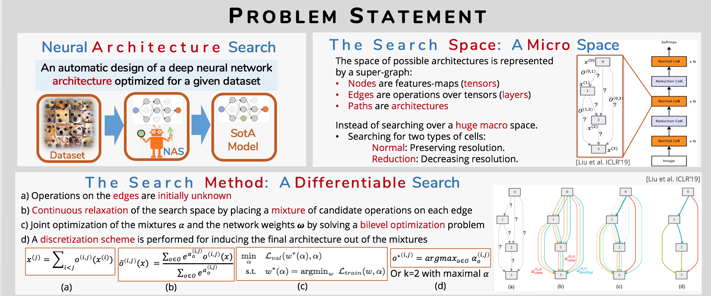
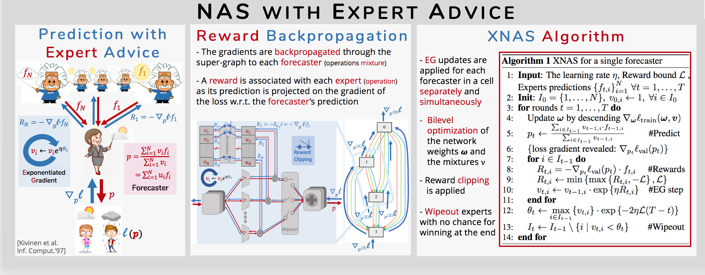
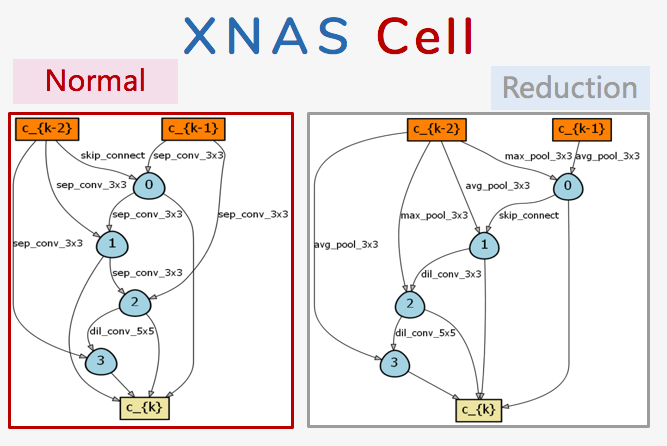
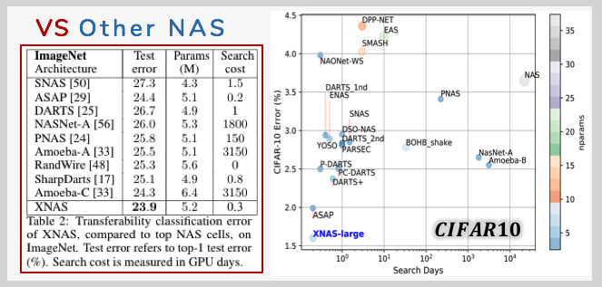

# XNAS: Neural Architecture Search with Expert Advice
Code accompanying the paper
> [XNAS: Neural Architecture Searchwith Expert Advice](https://arxiv.org/abs/1906.08031)\
> Niv Nayman, Asaf Noy, Tal Ridnik, Itamar Friedman, Rong Jin, Lihi Zelnik-Manor.\
> _arXiv:1906.08031_.

The algorithm is based on Prediction with Expert Advice theory (PEA) combined with continuous relaxation and gradient descent in the architecture space introduced in [DARTS](https://arxiv.org/abs/1806.09055). 
It is able to efficiently design high-performance convolutional architectures for image classification (on CIFAR-10, ImageNet and more).
<p align="center">
  
  
</p>
## Requirements
```
Python >= 3.5.5, PyTorch >= 1.1.0, torchvision >= 0.2.0, CUDA >= 10.0, cuDNN >= 7.5, thop
```

## Datasets
CIFAR-10 can be automatically downloaded by torchvision. 
ImageNet needs to be manually downloaded following the instructions [here](https://github.com/pytorch/examples/tree/master/imagenet).

## Reproducing the results
We hereby provide the trained models accompanied with the code necessary for reproducing the results reported in the paper.
<p align="center">
  
  
</p>

* Note: reduce the batch size in case of OOM errors, e.g. using the --batch_size flag (default value is 32).

**CIFAR-10 | XNAS-Small**
```
python test.py [--calc_flops] --init_channels=36 --model_path="trained_models/xnas_small_cifar10.t7"
```
* Expected result: 1.81% test error rate with 3.7M model parameters, 621M flops and inference time of 2.16ms per sample.

**CIFAR-10 | XNAS-Medium**
```
python test.py [--calc_flops] --init_channels=44 --model_path="trained_models/xnas_medium_cifar10.t7"
```
* Expected result: 1.73% test error rate with 5.6M model parameters, 905M flops and inference time of 2.20ms per sample.

**CIFAR-10 | XNAS-Large**
```
python test.py [--calc_flops] --init_channels=50 --model_path="trained_models/xnas_large_cifar10.t7"
```
* Expected result: 1.60% test error rate with 7.2M model parameters, 1.15G flops and inference time of 2.27ms per sample.

**ImageNet** 
```
python test_imagenet.py [--calc_flops] --model_path="trained_models/imagenet.pth.tar"
```
* Expected result: 23.9% top-1 error with 5.2M model parameters, 590M flops and inference time of 10.66ms per sample.

**CIFAR-10 | XNAS-Plain** 

i.e. XNAS cells trained in the same settings as of [DARTS](https://arxiv.org/abs/1806.09055) for another comparison.
```
python test.py [--calc_flops] --model_path="trained_models/xnas_plain.t7"
```
* Expected result: 2.48% test error rate with 3.8M model parameters, 621M flops and inference time of 2.18ms per sample.

## Citation
If you use any part of this code in your research, please cite our [paper](https://arxiv.org/abs/1806.09055):
```
@article{nayman2019xnas,
  title={XNAS: Neural Architecture Search with Expert Advice},
  author={Nayman, Niv and Noy, Asaf and Ridnik, Tal and Friedman, Itamar and Jin, Rong and Zelnik-Manor, Lihi},
  journal={arXiv preprint arXiv:1906.08031},
  year={2019}
}
```
and [DARTS](https://arxiv.org/abs/1806.09055) for providing the initial code.
